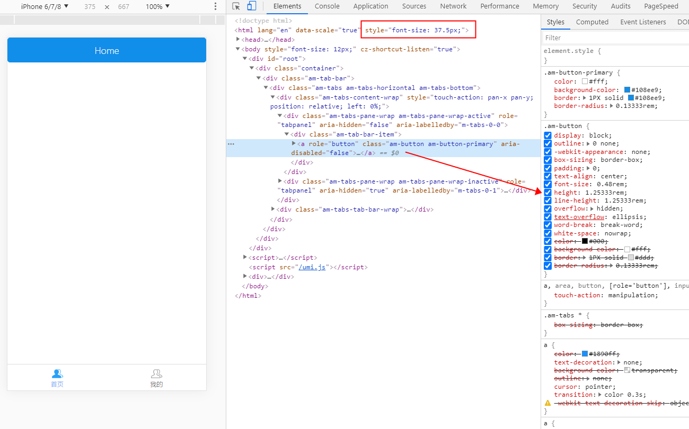

# umi project

## Getting Started

Install dependencies,

```bash
$ yarn
```

Start the dev server,

```bash
$ yarn start
```
## Adapted for mobile(install plugins)

```bash
# 根元素font-size 适配
yarn add amfe-flexible

# 自动转化px=> rem
yarn add postcss-pxtorem -D
```

## Configure px to rem automatically
.umirc.ts
```ts
const pxtorem = require('postcss-pxtorem');
extraPostCSSPlugins: [
    pxtorem({
        rootValue: 37.5, // iphone6 design, px units, how many px is the design, how many px do you write directly
        propWhiteList: [], // This is to make the px units of the ui library automatically converted to rem
        exclude: '/node_modules/', // 
    }),
],
```
<!-- 关于自动设置根元素 -->
### About automatically setting the root element font-size
```js
// 直接在文件里引入一次就可以了
import 'amfe-flexible';
```
